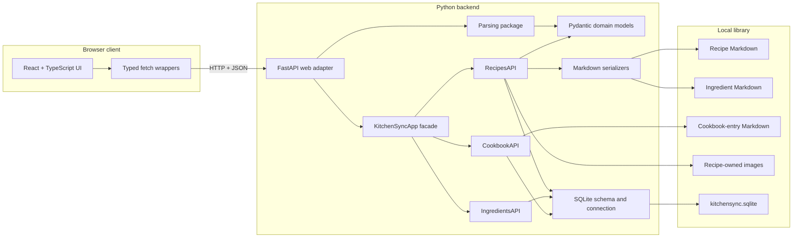
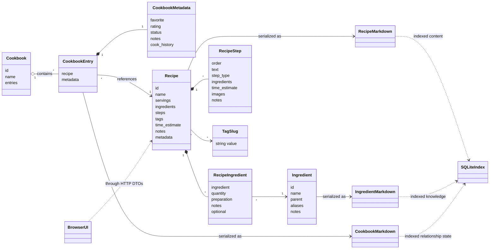
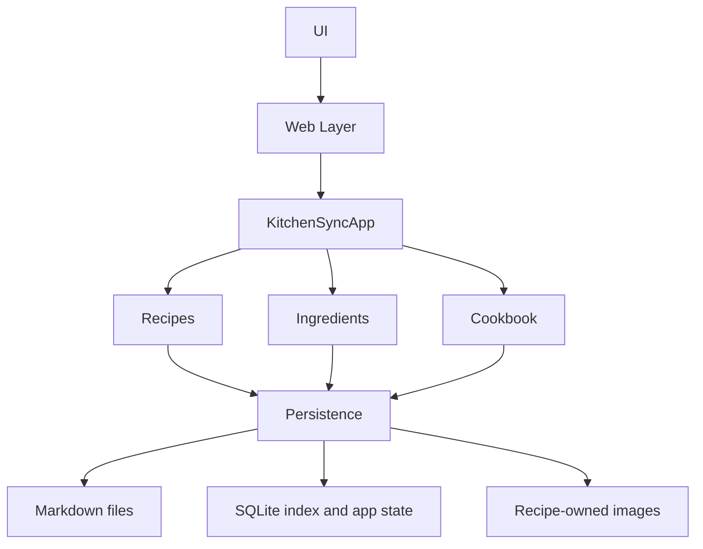
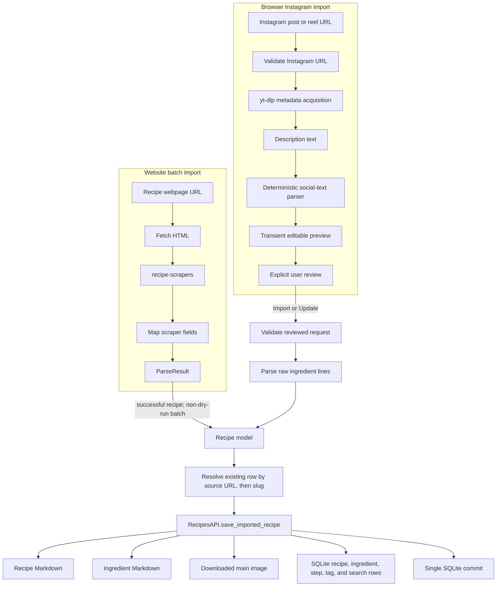
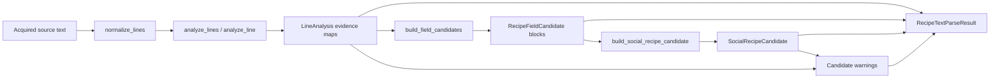
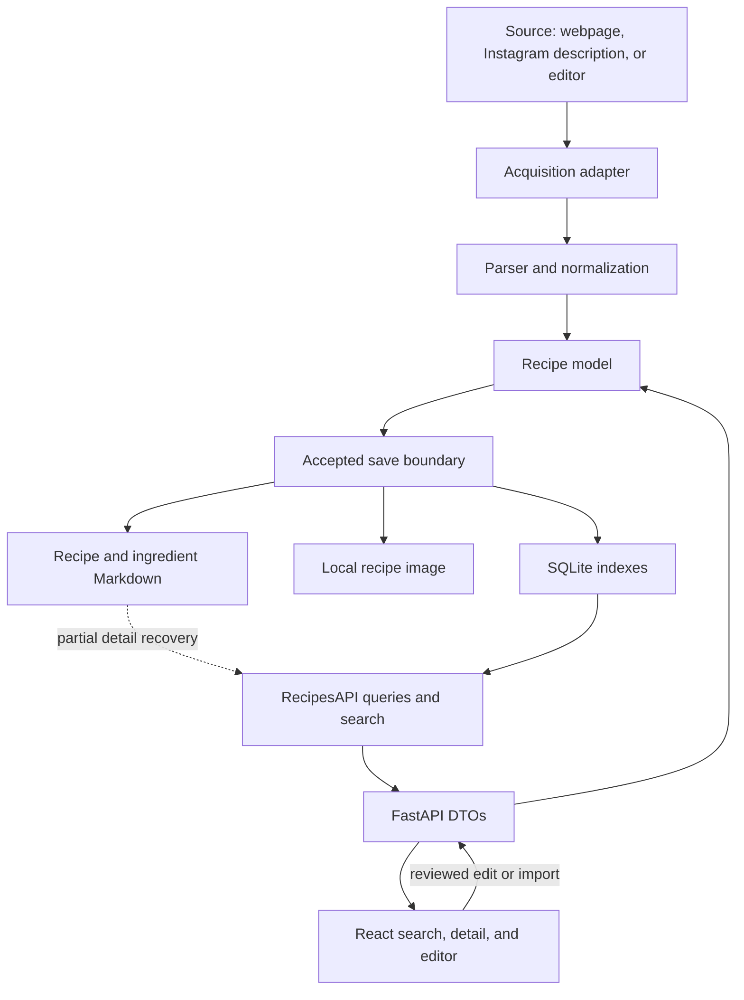
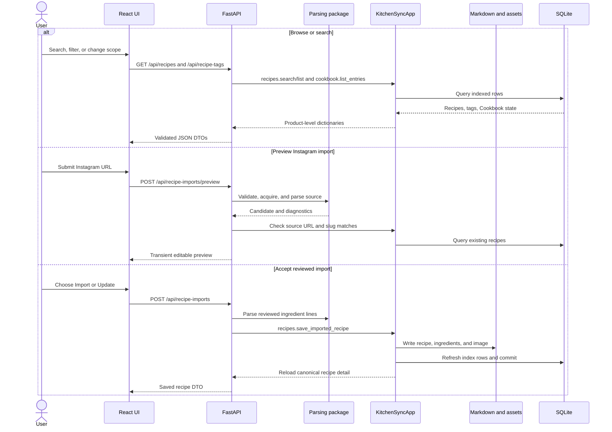
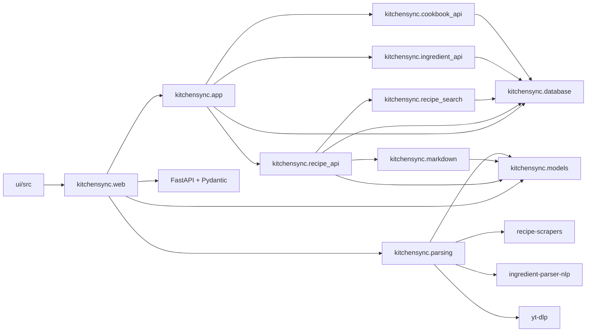

# KitchenSync Architecture Guide

This is the primary guide to the implemented KitchenSync architecture. It describes the repository as it exists now; future or partially implemented areas are labeled explicitly. Repository code, tests, and configuration remain the implementation truth.

## Project Overview

KitchenSync is a local-first recipe application for importing, reviewing, storing, finding, and editing recipes. Its durable recipe and ingredient records are human-readable Markdown. SQLite provides the fast local index and application state used by the browser UI. Python owns domain models, parsing, persistence, search, and HTTP behavior. React and TypeScript own presentation and temporary interaction state.

The current vertical slice supports:

- importing ordinary recipe webpages through a repeatable Python script;
- previewing and explicitly accepting Instagram recipe imports in the browser;
- writing accepted recipes, ingredients, cookbook entries, and recipe-owned images to the local library;
- indexing recipe, ingredient, tag, step, and cookbook data in one SQLite file;
- browsing and searching the global recipe catalog or Cookbook;
- editing recipes and Cookbook metadata through the browser UI.

PDF and image sources are recognized by the generic parser but are not implemented. Pantry, shopping-list, and candidate-review tables exist as schema boundaries, but their application APIs and UI flows are not implemented.

### Architecture at a glance

KitchenSync is one repository with two runtime toolchains:

- `src/kitchensync/` is the Python engine and FastAPI adapter.
- `ui/` is the React/Vite browser application.
- `data/library/` is the local library root used during development.

### Major subsystems

| Subsystem | Current responsibility | Primary location |
| --- | --- | --- |
| Domain models | In-memory recipe, ingredient, cookbook, quantity, tag, image, and step shapes | `src/kitchensync/models/` |
| Parsing | Source dispatch, webpage extraction, Instagram acquisition, deterministic social-text analysis, ingredient parsing, and parse diagnostics | `src/kitchensync/parsing/` |
| Application facade | Opens the local database and exposes product-oriented namespaces | `src/kitchensync/app.py` |
| Recipe catalog API | Accepted-save boundary, recipe files and images, index rows, detail reads, tags, filters, and delegated search ranking | `src/kitchensync/recipe_api.py`, `src/kitchensync/recipe_search.py` |
| Ingredient API | Read-only indexed ingredient catalog used by the editor | `src/kitchensync/ingredient_api.py` |
| Cookbook API | Cookbook-entry Markdown and its SQLite index | `src/kitchensync/cookbook_api.py` |
| Persistence formats | SQLite schema plus Markdown serializers | `src/kitchensync/database.py`, `src/kitchensync/markdown.py` |
| Web layer | Request validation, DTOs, endpoint orchestration, and local image serving | `src/kitchensync/web.py` |
| Browser UI | Recipe catalog, search and filters, detail/edit dialog, import review, and Cookbook state | `ui/src/` |
| Operational tools | Repeatable batch import and tracked research/canary workflows | `scripts/`, `scratch/` |

## Domain Model

The `Recipe` object is the central content model. A recipe owns ordered `RecipeIngredient` observations and ordered `RecipeStep` values. Each recipe ingredient references an `Ingredient`, plus optional quantity and preparation data. Tags are normalized strings rather than standalone entities.

A `Cookbook` is a collection concept, not another recipe catalog. A cookbook entry references one existing recipe and adds relationship state such as favorite, rating, notes, and cooking history. The current runtime stores one implicit local Cookbook through `CookbookAPI`; it does not yet construct the `Cookbook` Pydantic aggregate for normal reads and writes.

### Recipe

`models.recipe.Recipe` represents editable recipe content independently of HTTP and storage. It contains:

- a name and optional servings;
- ordered parsed ingredients;
- ordered steps;
- tag slugs;
- an optional time estimate;
- recipe notes;
- metadata such as description, source, author, importer, and images.

The model permits fields that the current Markdown or UI does not yet use fully, including step types, step-level ingredients, and step images. Those fields are domain capacity, not separate implemented workflows.

### Ingredient and recipe ingredient

`Ingredient` represents canonical ingredient knowledge: name, optional parent, aliases, and notes. `RecipeIngredient` is a recipe-owned observation of an ingredient, including quantity, preparation, optionality, and notes.

The distinction matters:

- `Ingredient` answers “what ingredient is this?”
- `RecipeIngredient` answers “how is it used in this recipe?”

The current v1 save path optimistically creates a minimal canonical ingredient file and row for an unseen parsed name. It reuses an existing ingredient by slug or alias. Candidate-first ingredient review is deferred.

### Cookbook

Cookbook membership does not clone a recipe. `cookbook_entries.recipe_id` points to the same recipe catalog row and adds favorite, rating, status, personal notes, and cooking metadata. Cookbook-entry Markdown is durable relationship state; the SQLite table indexes it for fast listing and joins.

### Tags

`TagSlug` is a string type alias. Tags are normalized with `slugify`, kept in recipe order in `recipe_tags`, and used for:

- exact hashtag filtering;
- meal, cuisine, and diet filter groups;
- fuzzy search at lower weight than title matches;
- tag autocomplete and recipe counts.

There is no tag registry or tag service in the current implementation.

### Markdown

Markdown is the portable, human-first representation for:

- recipe content under `recipes/{slug}/recipe.md`;
- canonical ingredients under `ingredients/{slug}.md`;
- Cookbook relationship state under `cookbook/{recipe_slug}.md`.

The writer is implemented. A complete Markdown-to-model parser and full database rebuild command are not. Recipe detail reads currently recover only description and notes from canonical recipe Markdown; most list and detail fields are read from SQLite.

### Database

KitchenSync v1 uses one SQLite file with logical table families:

- `recipe_*`
- `ingredient_*`
- `cookbook_*`
- `pantry_*`
- `shopping_*`
- `candidate_*`

Recipe, ingredient, and cookbook index rows are intended to be rebuildable from Markdown. Pantry, shopping, and unresolved candidate workflow rows are durable application state. The rebuild tooling is not implemented yet, so the architectural “disposable index” promise is a target contract rather than a complete recovery operation today.

### UI

The React UI does not manipulate domain models, Markdown, or SQLite directly. It uses TypeScript DTOs and focused `fetch` wrappers. Form state remains transient until an explicit save request succeeds. Import preview and cancel do not persist data.

## Application Flow

The normal application boundary is:

`KitchenSyncApp.open(...)` creates a SQLite connection, applies the base schema and additive migrations, and exposes:

- `app.recipes`
- `app.ingredients`
- `app.cookbook`

The intended pantry, shopping, and candidate namespaces are not exposed yet. Web endpoints open a short-lived app context for each request. Scripts may hold one app context across a batch.

Parsing is adjacent to the app facade rather than hidden inside it. The web import endpoints and operational scripts explicitly call parser entry points, then pass an accepted `Recipe` to `app.recipes.save_imported_recipe(...)`.

## Recipe Import Pipeline

KitchenSync currently has two implemented import entry paths with one shared accepted-save boundary.

### Pipeline overview

### Website import stages

1. **Acquisition** — `parse_recipe(...)` recognizes an HTTP(S) URL and routes it to `parse_recipe_url(...)`. The webpage parser fetches HTML with a KitchenSync user agent and a ten-second timeout.
2. **Extraction** — `recipe-scrapers.scrape_html(...)` selects a generic or supported-site scraper.
3. **Normalization** — helper functions normalize yields, minutes, tags, images, and instruction lists.
4. **Ingredient parsing** — each raw ingredient line passes through `parse_recipe_ingredient_line(...)`.
5. **Model creation** — scraper values become a Pydantic `Recipe`.
6. **Parse result** — the parser returns `ParseResult.SUCCESS` with the recipe or `ParseResult.FAILED` with a message. There is no second website parser fallback yet.
7. **Batch decision** — `scripts/import_recipe_urls.py` records a report row. In dry-run mode it stops there. Otherwise, every successful parsed recipe is sent to the accepted-save boundary.
8. **Persistence** — `RecipesAPI.save_imported_recipe(...)` writes Markdown/assets and refreshes index rows.

The batch script is an operational import tool, not the review-first browser flow. It preserves URL order and reports parse and save failures individually.

### Instagram browser-import stages

1. **Acquisition request** — the UI posts a public Instagram post or reel URL to `/api/recipe-imports/preview`.
2. **URL validation** — `validate_instagram_url(...)` accepts only HTTP(S) Instagram post and reel paths.
3. **Source acquisition** — `acquire_instagram_source(...)` calls `yt-dlp` without downloading media and returns description, author, source name, canonical source URL, and thumbnail URL.
4. **Text normalization and analysis** — `parse_recipe_text(...)` normalizes description lines and computes independent evidence for each line.
5. **Grouping** — adjacent compatible evidence becomes field candidates for ingredients, steps, description, notes, name, tags, and servings.
6. **Candidate creation** — the parser builds a review-only `SocialRecipeCandidate`.
7. **Completeness decision** — warnings are produced when no reliable name, ingredient section, or instruction section is found. Warnings set `fallback_recommended`; no automatic fallback provider is implemented.
8. **Duplicate preview** — the web layer checks existing recipes by canonical source URL and normalized title slug.
9. **Editable preview** — the UI displays original source evidence and reuses the normal recipe editor. Nothing has been written.
10. **Explicit acceptance** — the user chooses Import Recipe or Update Existing Recipe. The save endpoint requires a title plus at least one ingredient and one step.
11. **Request normalization** — raw ingredient lines are parsed, steps are ordered, tags are normalized and deduplicated, time becomes `TimeEstimate`, and source metadata becomes `RecipeMetadata`.
12. **Duplicate enforcement** — source URL and slug must identify zero or one recipe consistently, and the requested duplicate action must match the result.
13. **Persistence** — the reviewed `Recipe` crosses `save_imported_recipe(...)` exactly once.
14. **Response** — the web layer reloads recipe detail and returns the canonical saved representation to the UI.

### Accepted-save stages

`RecipesAPI.save_imported_recipe(...)` is the public consistency boundary:

1. derive the recipe slug;
2. reuse a recipe ID by source URL, then slug, or allocate a UUID hex ID;
3. best-effort download the first metadata image and preserve the existing image on a failed update download;
4. write recipe Markdown;
5. create missing minimal ingredient Markdown files and ingredient rows;
6. upsert the recipe metadata row;
7. replace recipe ingredient, step, and tag rows;
8. rebuild the recipe search text row;
9. commit SQLite changes.

Filesystem writes cannot participate in the SQLite transaction. The method minimizes divergence by centralizing the operations, but a complete repair/rebuild command remains future work.

## Parser Architecture

### Entry points

| Entry point | Input | Output | Current consumers |
| --- | --- | --- | --- |
| `parse_recipe(source)` | URL or local path | `ParseResult` | Batch import script, parser tests |
| `parse_recipe_url(url)` | Recipe webpage URL | `ParseResult` | Generic dispatcher |
| `validate_instagram_url(url)` | User-supplied URL | Normalized URL or `ValueError` | Preview and save endpoints |
| `acquire_instagram_source(url)` | Valid Instagram URL | `InstagramSource` | Preview endpoint, canary |
| `parse_recipe_text(text)` | Already acquired social description/caption/transcript | `RecipeTextParseResult` | Preview endpoint, social corpus |
| `parse_recipe_ingredient_line(text)` | One raw ingredient line | `RecipeIngredient` | Webpage parser, import save, recipe update |
| `project_ingredient_line(text)` | One raw ingredient line | Lossless editor projection | Ingredient editor endpoint |
| `parse_recipe_pdf(path)` | PDF path | `ParseResult.NOT_IMPLEMENTED` | Generic dispatcher |
| `parse_recipe_image(path)` | Image path | `ParseResult.NOT_IMPLEMENTED` | Generic dispatcher |

### Social-text parser stages

The stages are deterministic and platform-independent after acquisition:

1. **Normalization** preserves line order and blank lines while trimming each line.
2. **Line analysis** assigns independent evidence for concepts such as heading, ingredient, instruction, nutrition, servings, metadata, timing, tag, narrative, blank, and divider.
3. **Context grouping** uses blank lines, dividers, headings, proximity, and dominant field scores to form blocks.
4. **Candidate extraction** derives name, description, servings, raw ingredients, steps, tags, and notes.
5. **Fallback decision** emits warnings and marks incomplete candidates. It recommends external handling but does not execute an LLM or another parser.

### Confidence handling

Social parser evidence values and field scores are rule weights from `0.0` to `1.0`, not probabilities. They do not need to sum to one. Most extraction decisions use explicit thresholds such as `0.5` or `0.8` plus context rules.

`ingredient-parser-nlp` is supporting evidence:

- a convincing parse increases ingredient evidence;
- a bullet with a weak ingredient parse can increase instruction evidence;
- ingredient context can override an ambiguous line-level result;
- the underlying name confidence is consulted only in a narrow single-name case.

There is no calibrated overall recipe confidence score. Completeness is represented by concrete warnings and `fallback_recommended`.

### Intermediate models

| Model | Purpose |
| --- | --- |
| `ParseResult` | Generic parser status, source, optional `Recipe`, and failure message |
| `InstagramSource` | Acquired source evidence before parsing |
| `LineAnalysis` | One normalized line and its non-exclusive evidence map |
| `RecipeFieldCandidate` | One contextual block and possible recipe-field scores |
| `SocialRecipeCandidate` | Incomplete, review-only extracted fields |
| `RecipeTextParseResult` | Candidate plus diagnostics, warnings, and fallback recommendation |
| `RecipeImportDraftDto` | Browser-editable projection returned by preview |
| `RecipeUpdateRequest` | Validated editable content accepted by update/import endpoints |
| `Recipe` | Canonical in-memory domain object sent to persistence |

### Fallback behavior

Fallback behavior is intentionally conservative:

- generic webpage failures return `ParseResult.FAILED`;
- unsupported sources return `UNSUPPORTED_SOURCE`;
- PDF and image routes return `NOT_IMPLEMENTED`;
- social parsing returns the best deterministic candidate plus warnings;
- the UI keeps incomplete content editable but the save endpoint still requires ingredients and steps;
- no LLM or automatic network fallback runs inside the production parser.

## Data Flow

List, filter, and search reads come from SQLite. Recipe details combine indexed data with Markdown-backed description and notes. Local images are served by FastAPI under `/library/...` and proxied by Vite during development.

## UI to Backend Flow

## Module Dependencies

The dependency direction is generally inward toward models and persistence primitives. The web layer orchestrates but does not own parsing or storage rules. The UI depends only on HTTP contracts.

## Module Responsibilities

### Package-root modules

| Module | Responsibility | Public API | Key dependencies | Current consumers |
| --- | --- | --- | --- | --- |
| `kitchensync.__init__` | Minimal package facade | `KitchenSyncApp` | `app` | Tests, scripts, canaries |
| `kitchensync.app` | Database lifecycle and product namespaces | `KitchenSyncApp`, `DEFAULT_DATABASE_PATH` | API modules, `database` | Web endpoints, scripts, tests |
| `kitchensync.database` | SQLite schema, connection configuration, row conversion, additive migration | `SCHEMA_SQL`, `connect`, `migrate_schema`, `row_dict`, `rows` | Python `sqlite3` | App and API modules |
| `kitchensync.markdown` | Human-first recipe and ingredient serialization plus slug/raw-line helpers | Names in `__all__` | Models, filesystem | Recipe API, tests, scratch |
| `kitchensync.recipe_api` | Recipe accepted-save boundary, reads, updates, and stable search methods that delegate internally | `RecipesAPI` methods | Database, Markdown, models, recipe search, filesystem/network stdlib | `KitchenSyncApp`, tests |
| `kitchensync.recipe_search` | Internal recipe filtering, tag counts, and fuzzy relevance ranking | `search_recipes`, `list_recipe_tags` for `RecipesAPI` delegation | Database rows, slug normalization, standard-library matching | `RecipesAPI` |
| `kitchensync.ingredient_api` | Indexed ingredient catalog reads | `IngredientsAPI.list` | Database | `KitchenSyncApp`, ingredient endpoint |
| `kitchensync.cookbook_api` | Cookbook-entry Markdown and index synchronization | `CookbookAPI.save_entry`, `index_entry`, `list_entries`, `get_entry` | Database, filesystem | `KitchenSyncApp`, web endpoints |
| `kitchensync.web` | FastAPI app, DTO validation, endpoint orchestration, local asset URLs | `app` and HTTP routes | App facade, parsing, models, FastAPI | Uvicorn, React UI, tests |

`main.py` is still the generated placeholder and is not a KitchenSync runtime entry point. The backend entry point is `kitchensync.web:app`; repeatable imports use `scripts/import_recipe_urls.py`.

### Model modules

| Module | Responsibility | Public API | Dependencies | Consumers |
| --- | --- | --- | --- | --- |
| `models.__init__` | Stable re-export surface | Names in `__all__` | Model modules | All Python layers |
| `models.common` | Shared quantity and unit types | `Quantity`, `UnitSlug` | Pydantic | Recipe/ingredient parsing |
| `models.ingredient` | Canonical ingredient shape | `Ingredient`, `IngredientSlug` | Pydantic | Recipe model, Markdown, APIs |
| `models.recipe` | Recipe aggregate and supporting step/image/time types | `Recipe`, `RecipeIngredient`, `RecipeMetadata`, `RecipeStep`, `RecipeStepType`, `TimeEstimate`, `ImageRef` | Pydantic, ingredient/common/tags | Parsers, web, persistence |
| `models.cookbook` | In-memory Cookbook aggregate | `Cookbook`, `CookbookEntry`, `CookbookMetadata`, `CookEvent` | Pydantic, recipe model | Smoke tests; future richer Cookbook logic |
| `models.tags` | Tag identifier type | `TagSlug` | Typing stdlib | Recipe model |

### Parsing modules

| Module | Responsibility | Public API | Dependencies | Consumers |
| --- | --- | --- | --- | --- |
| `parsing.__init__` | Stable parser re-export surface | Names in `__all__` | Parser modules | Web, scripts, tests |
| `parsing.recipe` | Generic source dispatch | `parse_recipe` | URL/path stdlib, web/pdf/image parsers | Batch imports, tests |
| `parsing.result` | Generic parser status contract | `ParseStatus`, `ParseResult` | Pydantic, Recipe | All generic parsers |
| `parsing.web` | Recipe webpage acquisition and `recipe-scrapers` mapping | `parse_recipe_url` | `recipe-scrapers`, models, ingredient parser | Generic dispatcher |
| `parsing.instagram` | Instagram URL validation and metadata acquisition | `InstagramSource`, `validate_instagram_url`, `acquire_instagram_source` | `yt-dlp` | Web preview, canary |
| `parsing.social` | Compatibility-preserving package facade and deterministic social-text pipeline orchestration | `parse_recipe_text`, candidate/diagnostic types, analysis helpers used by scratch compatibility | Social parser stage modules | Web preview, corpus tests, scratch |
| `parsing.ingredients` | Lossless editor projection and ingredient-line-to-domain parsing | `project_ingredient_line`, `parse_recipe_ingredient_line` | `ingredient-parser-nlp`, models, units | Webpage/social save and editor |
| `parsing.units` | Minimal unit normalization and category checks | `normalize_unit`, `is_container_unit`, `is_measurable_unit` | None | Ingredient parser |
| `parsing.pdf` | PDF route placeholder | `parse_recipe_pdf` | Parse result | Generic dispatcher |
| `parsing.image` | Image route placeholder | `parse_recipe_image` | Parse result | Generic dispatcher |

### Social parser stage modules

| Module | Responsibility | Direct dependencies |
| --- | --- | --- |
| `parsing.social.models` | Parser intermediate Pydantic models | Pydantic |
| `parsing.social.patterns` | Shared compiled regex vocabulary and fixed headings | Regex stdlib |
| `parsing.social.normalize` | Lossless source-line normalization | None |
| `parsing.social.analysis` | Independent line evidence and ingredient-parser support | Models, patterns, normalization, `ingredient-parser-nlp` |
| `parsing.social.grouping` | Context blocks and recipe-field candidates | Models, patterns, analysis helpers |
| `parsing.social.name` | Recipe-name extraction and cleanup | Models, patterns, regex/unicode stdlib |
| `parsing.social.content` | Contextual ingredient and step extraction | Models, patterns, analysis and grouping helpers |
| `parsing.social.candidate` | Candidate assembly, description, servings, tags, and notes | Models, name, content, patterns |
| `parsing.social.fallback` | Missing-field warnings and fallback recommendation input | Models, patterns |

### UI modules

| Module | Responsibility | Dependencies | Consumers |
| --- | --- | --- | --- |
| `ui/src/main.tsx` | React root and strict mode | React DOM, `App` | Browser |
| `ui/src/App.tsx` | Global/Cookbook browse state, search coordination, recipe/import dialog selection | Recipe feature components, API wrapper | React root |
| `features/recipes/RecipeMainView.tsx` | Detail display, recipe editor, Cookbook panel, and Instagram import review | API wrapper, ingredient editor | `App` |
| `features/recipes/RecipeIngredientEditor.tsx` | Rich/raw ingredient editing, catalog matching, reorder, unit preferences | Ingredient endpoints and DTOs | Recipe editor |
| `features/recipes/RecipeSearchControls.tsx` | Search input, hashtag completion, and grouped filters | React state and recipe tag DTOs | `App` |
| `lib/api/recipes.ts` | Focused HTTP calls and common error handling | Native `fetch`, DTO types | Recipe UI features |
| `lib/api/recipe-types.ts` | TypeScript copies of current HTTP contracts | TypeScript | API wrapper and components |

## Folder Guide

| Folder | Purpose | Put new work here when |
| --- | --- | --- |
| `.agents/` | Repository-specific AI work, design-source, drift, and commit policies | Updating durable contributor/agent policy |
| `.codex/` | Local Codex workspace metadata when present | Tooling creates it; application code does not belong here |
| `.git/` | Git repository metadata | Never edit directly |
| `.pytest_cache/` | Generated pytest cache | Never add source files |
| `.venv/` | Local generated Python environment | Never add source files or commit it |
| `.vscode/` | Small repository editor defaults | A setting is genuinely shared by contributors |
| `data/` | Local ignored KitchenSync library and generated operational output | Creating runtime recipe data, indexes, images, or import reports; not source code |
| `docs/` | Durable implementation, architecture, schema, and UI guidance | A decision or explanation should survive across machines and sessions |
| `docs/archive/` | Historical reference that is not implementation truth | Preserving superseded documentation |
| `docs/ui-plan/` | Product-facing UI flows, screens, and component plans | Describing intended UI behavior rather than framework mechanics |
| `scratch/` | Tracked experiments, corpus evidence, canaries, and temporary research plans | Testing an uncertain parsing/import idea before promoting reusable behavior |
| `scripts/` | Repeatable, thin operational entry points | Orchestrating stable package APIs for maintenance or batch work |
| `src/kitchensync/` | Installable Python application package | Adding reusable backend behavior |
| `src/kitchensync/models/` | UI- and storage-independent domain shapes | Adding or extending a domain concept after the design is settled |
| `src/kitchensync/parsing/` | Acquisition adapters, parsing stages, normalization, and diagnostics | Adding reusable source or text parsing behavior |
| `tests/` | Automated behavior and contract verification | Pinning existing or explicitly accepted behavior |
| `ui/` | Independent npm/Vite toolchain | Changing browser UI, HTTP client types, assets, or frontend build configuration |
| `ui/src/features/` | Product-oriented UI behavior | A component belongs to one feature domain |
| `ui/src/lib/api/` | Browser/backend boundary | Adding a backend DTO or focused HTTP operation |
| `ui/public/` and `ui/src/assets/` | Static UI-owned assets | An asset ships with the application rather than a recipe library |
| `ui/node_modules/` and `ui/dist/` | Generated dependencies and build output | Never add source files or edit by hand |

When placement is unclear, keep these rules:

- business concepts belong in models or product APIs, not FastAPI routes or React components;
- source interpretation belongs in parsing, not persistence;
- accepted writes must cross the public recipe or Cookbook save boundary;
- scripts orchestrate package APIs instead of reimplementing them;
- scratch code is promoted only after its behavior is accepted and tested;
- storage format rules belong in `markdown.py`, `database.py`, and their schema docs;
- UI-only state remains in React; durable state belongs behind the Python API.
