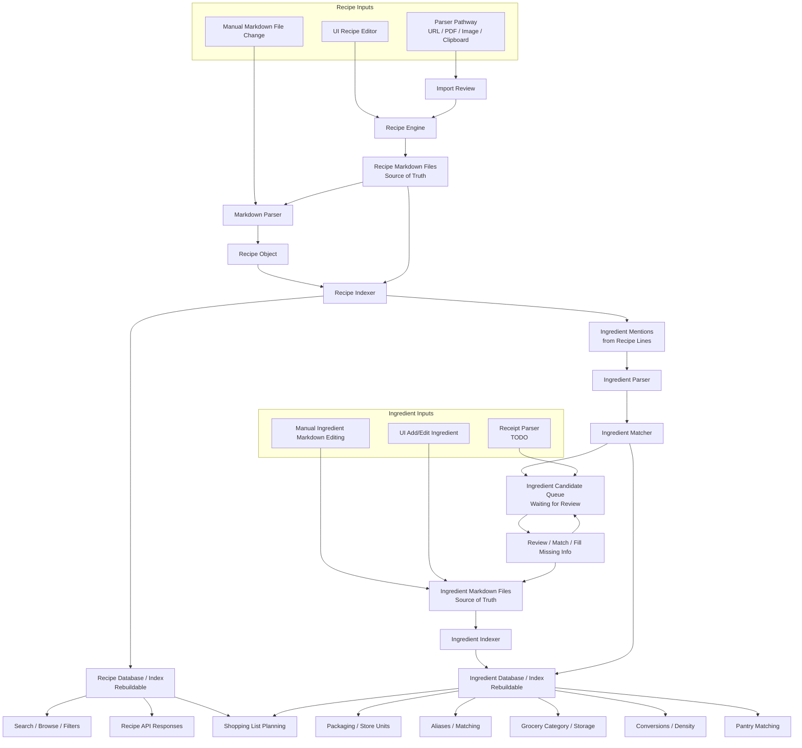

# Model Data Flow

This document describes how recipe and ingredient data move through KitchenSync. It complements the system-boundary notes by focusing on lifecycle: where data enters, what becomes durable, what is rebuildable, and what needs review.

## Core Decisions

- Recipe Markdown is the durable source of truth for recipe content.
- The recipe database is a rebuildable index/cache derived from recipe Markdown.
- Ingredient Markdown is the durable source of truth for canonical ingredient knowledge.
- The ingredient database is a rebuildable index/cache derived from ingredient Markdown.
- New or uncertain ingredient observations should enter a review queue before becoming canonical ingredient data.
- Receipt parsing should use the same ingredient candidate flow as recipe imports.

## Data Flow Diagram

## Recipe Data Rules

- Recipe data enters through the UI recipe editor, manual Markdown edits, or parser/import pathways.
- Accepted recipe content is written to Markdown.
- The recipe database is rebuilt by parsing Markdown files.
- Recipe search, browse, filters, and API responses read from the recipe database for speed.
- Parsed recipe ingredient fields are database/index output, not saved Markdown content.

## Ingredient Data Rules

- Ingredient lines from recipes create ingredient observations.
- Observations are parsed and matched against canonical ingredients and aliases.
- High-confidence matches may link recipe ingredient rows to existing ingredient entries.
- Low-confidence matches and new ingredients must become candidates waiting for review.
- Canonical ingredient Markdown should not be polluted by parser mistakes or one-off wording from recipe imports.
- Canonical ingredient files can accumulate aliases, packaging, store units, grocery category, storage area, conversions, and notes.

## Ingredient Candidate Queue

The candidate queue is durable app state until reviewed. It is not recipe source-of-truth data.

Candidate sources:

- Recipe import or recipe Markdown indexing
- Manual ingredient entry
- Receipt parsing
- Future barcode/store integrations

Candidate statuses:

- `pending_review`: created and waiting for a user decision.
- `matched`: linked to an existing ingredient.
- `approved_new`: promoted into a new canonical ingredient.
- `approved_alias`: added as an alias for an existing ingredient.
- `rejected`: bad parse or invalid candidate.
- `ignored`: intentionally left unresolved.

Review actions:

- Match to an existing ingredient.
- Create a new ingredient.
- Add as an alias.
- Fix the parsed/display name.
- Add packaging, category, storage, or conversion details.
- Reject bad parser output.
- Ignore low-value entries.

## Database Role Split

Rebuildable from recipe Markdown:

- Recipe metadata index
- Recipe step index
- Recipe ingredient rows
- Full-text search tables
- Parser-derived ingredient names, quantities, units, and preparations

Durable app knowledge:

- Ingredient candidate review state
- User corrections waiting to be applied to ingredient Markdown

Rebuildable from ingredient Markdown:

- Canonical ingredients
- Ingredient aliases
- Ingredient packaging
- Ingredient conversions
- Ingredient categories and storage rules
- Ingredient matching guidance

See `docs/ingredient-markdown-schema.md` for the canonical ingredient file contract.
