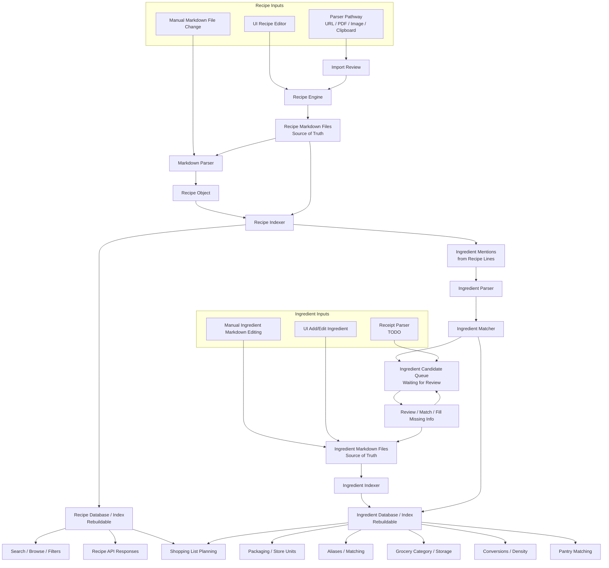

# Model Data Flow

This document describes how recipe and ingredient data move through KitchenSync. It complements the system-boundary notes by focusing on lifecycle: where data enters, what becomes durable, what is rebuildable, and what needs review.

## Core Decisions

- Recipe Markdown is the durable source of truth for recipe content.
- The recipe database is a rebuildable index/cache derived from recipe Markdown.
- Ingredient Markdown is the durable source of truth for canonical ingredient knowledge.
- The ingredient database is a rebuildable index/cache derived from ingredient Markdown.
- Cookbook entry Markdown is the durable source of truth for cookbook-specific recipe metadata.
- The cookbook database is a rebuildable index/cache derived from cookbook entry Markdown.
- V1 uses one physical SQLite database with separate logical areas for recipe, ingredient, cookbook, pantry, shopping, and candidate data.
- Pantry inventory, shopping lists, and candidate review state are durable app state.
- V1 assumes parsed imported recipe ingredients are good enough to auto-create or reuse canonical ingredient records.
- V2 should route imported ingredient observations through a review queue before they become canonical ingredient data.
- Receipt parsing should use the v2 ingredient candidate flow unless v1 still needs a quick optimistic import path.

## Data Flow Diagram

## Recipe Data Rules

- Recipe data enters through the UI recipe editor, manual Markdown edits, or parser/import pathways.
- Accepted recipe content is written to Markdown.
- The recipe database is rebuilt by parsing Markdown files.
- Recipe search, browse, filters, and API responses read from the recipe database for speed.
- Parsed recipe ingredient fields are database/index output, not saved Markdown content.

## Ingredient Data Rules

- Ingredient lines from recipes create ingredient observations.
- Observations are parsed and matched against canonical ingredients and aliases.
- In v1, unmatched parsed ingredient names create minimal canonical ingredient Markdown files and database rows.
- Recipe ingredient rows keep raw text and parsed fields so bad v1 ingredient splits can be cleaned up later.
- In v2, low-confidence matches and new ingredients should become candidates waiting for review.
- Canonical ingredient files can accumulate aliases, packaging, store units, grocery category, storage area, conversions, and notes.

## Ingredient Candidate Queue

The candidate queue is durable app state until reviewed. It is not recipe source-of-truth data.

V1 does not use the candidate queue for normal imported recipe ingredients. That shortcut keeps early corpus building fast. After roughly 30-50 recipes, ingredient cleanup should identify which duplicates, aliases, and parser mistakes need a v2 candidate-first flow.

Candidate sources:

- V2 recipe import or recipe Markdown indexing
- Manual ingredient entry
- Receipt parsing
- Future barcode/store integrations

Candidate statuses:

- `pending_review`: created and waiting for a user decision.
- `matched`: linked to an existing ingredient.
- `approved_new`: promoted into a new canonical ingredient.
- `approved_alias`: added as an alias for an existing ingredient.
- `rejected`: bad parse or invalid candidate.
- `ignored`: intentionally left unresolved.

Review actions:

- Match to an existing ingredient.
- Create a new ingredient.
- Add as an alias.
- Fix the parsed/display name.
- Add packaging, category, storage, or conversion details.
- Reject bad parser output.
- Ignore low-value entries.

## Database Role Split

See `docs/database-v1.md` for the physical SQLite file and table-prefix contract.

Rebuildable from recipe Markdown:

- Recipe metadata index
- Recipe step index
- Recipe ingredient rows
- Full-text search tables
- Parser-derived ingredient names, quantities, units, and preparations

Durable app knowledge:

- Pantry inventory
- Shopping lists
- Ingredient candidate review state, when enabled by a review workflow
- User corrections waiting to be applied to ingredient Markdown

Rebuildable from cookbook entry Markdown:

- Cookbook membership
- Cookbook-specific notes, ratings, favorite state, status, and cook history
- Cookbook entry search rows

Rebuildable from ingredient Markdown:

- Canonical ingredients
- Ingredient aliases
- Ingredient packaging
- Ingredient conversions
- Ingredient categories and storage rules
- Ingredient matching guidance

See `docs/ingredient-markdown-schema.md` for the canonical ingredient file contract.
